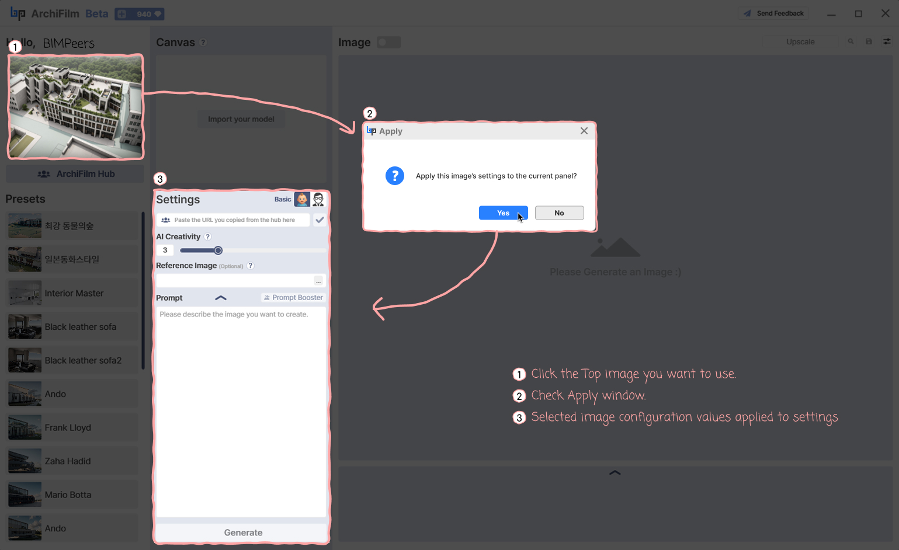

# 1. How to use top 3 Images

<figure><figcaption></figcaption></figure>

You can quickly generate images by utilizing popular images from the **ArchiFilm Hub**.

***

### Select Image to Apply

* Click on a desired image from the popular images displayed at the top of the ArchiFilm Hub.

***

### Confirm Settings Application

* A confirmation window will appear asking:\
  &#xNAN;_“Apply this image’s settings to the current panel?”_

***

### Apply and Generate

* Click **Yes** to apply the settings (use for, creativity, prompt, etc.) used to generate that image directly to your current Settings panel.
* After the values are applied, click **Generate** to create a new image based on those settings.

