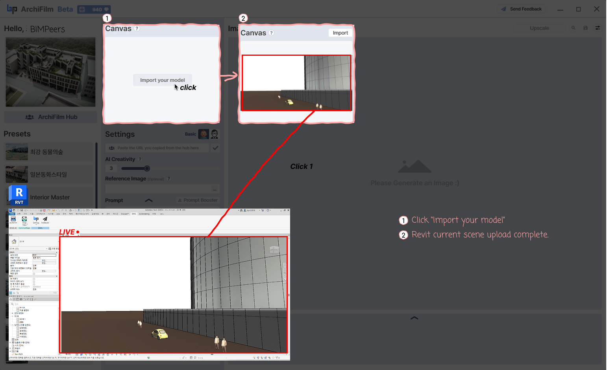

# 3. How to use Canvas

<figure><figcaption></figcaption></figure>

You can import the 3D view you are currently working on in Revit into **ArchiFilm** to prepare for rendering.

***

### Click **"Import your model"**

* In the **Canvas area** at the center of the ArchiFilm interface, click the **Import your model** button.

***

### Upload Current Revit View

* When clicked, the currently active 3D view in Revit will be loaded and displayed in the ArchiFilm **Canvas area**.
* This imported model becomes the base for adjusting settings and generating images.

> **Tip**
>
> Before importing your model, setting your view as below will help the AI generate better images! 

<figure><figcaption></figcaption></figure>
