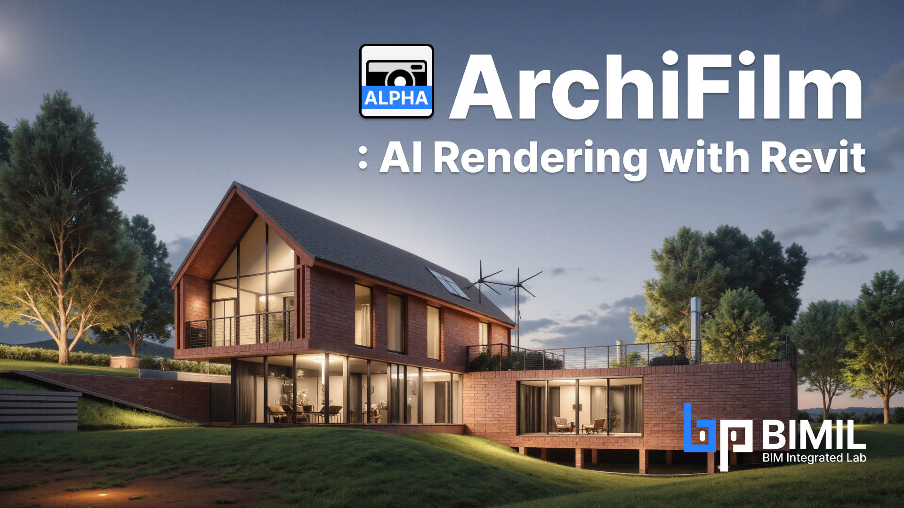
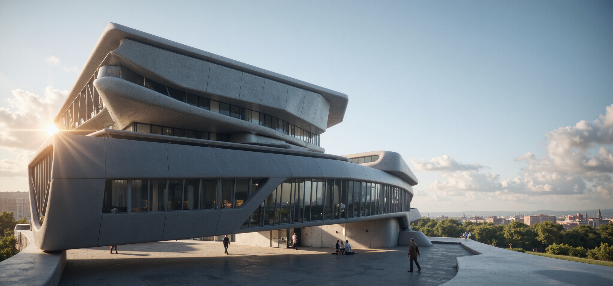
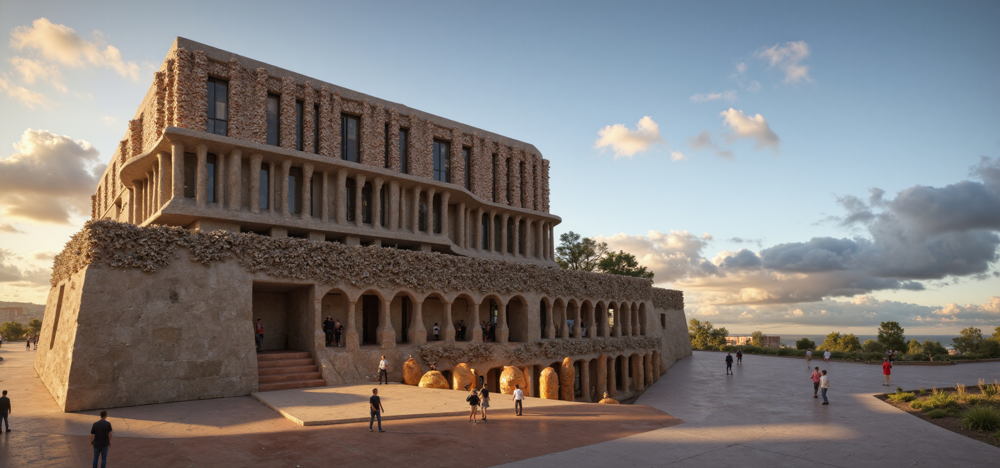
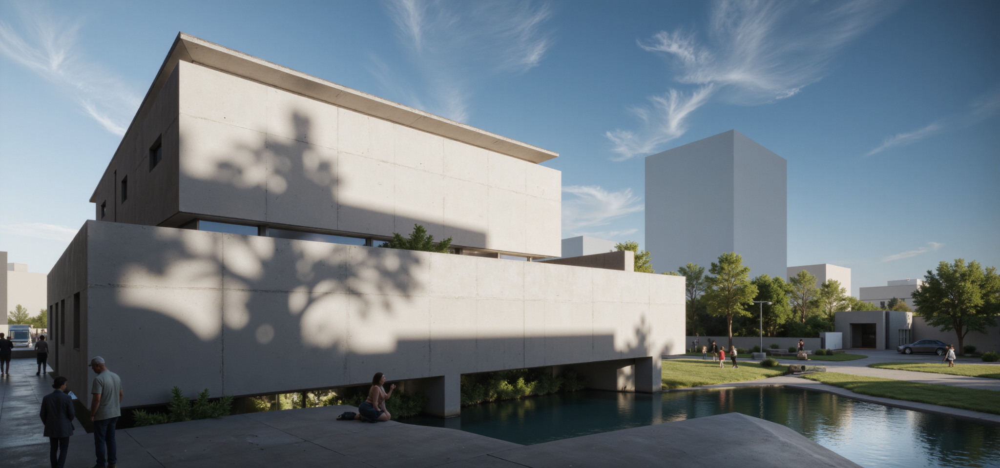

# ArchiFilm (NEW)


**ArchiFilm Alpha Version Release Notice**

The ArchiFilm add-in will be available starting **June 9, 2025 at 04:00 AM UTC** (**KST 1:00 PM**).

This **Alpha version** is being released for testing purposes only.\
You will receive **30 free credits**, and **additional credits cannot be recharged** once used.

If you encounter any bugs or have suggestions for improvement, please use the **Feedback** button located at the top right of the add-in. Your input will be greatly appreciated and will help us improve the service.


**ArchiFilm** is a smart Revit add-in that turns your 3D model views into high-quality, presentation-ready renderings—instantly. Without exporting to external software or relying on CG studios, you can now generate compelling visuals directly from your Revit scenes.

<figure><figcaption></figcaption></figure>

## **Features**

* **One-Click Rendering with Custom Prompts**\
  Render any view from your Revit model with just one click. Add prompts to describe desired atmosphere, materials, lighting, or style—ArchiFilm interprets your input to create visually appealing images without the need for manual setup.
* **Prompt Enhancer**\
  Unsure how to phrase your prompt? Use the built-in AI-enhancer to refine and optimize your description for better rendering results—even if you're new to visual scripting.
* **Multilingual Prompt Support**\
  Write prompts in any language. ArchiFilm uses GPT-based language models to understand and process instructions in all major languages supported by ChatGPT.
* **Preset Management**\
  Save your favorite prompts and rendering settings as **presets**. Easily reuse them across different views or projects to ensure consistency and save time.
* **Upscaling Generated Images**\
  Generated images can be upscaled to high-resolution formats—ideal for use in presentations, reports, or design deliverables.
* **ArchiFilm Hub**\
  Browse images created by other users. See which prompts and settings were used, and apply them to your own scenes for inspiration or quick testing.

## **Notes**

* Works with any 3D view currently active in Revit.
* Requires internet access for prompt processing and Hub features.
* Output quality depends on view composition and prompt clarity.

<figure><figcaption></figcaption></figure>

## Sample Images

<figure><figcaption>
Zaha Hadid
</figcaption></figure> <figure><figcaption>
Gaudi
</figcaption></figure> <figure><figcaption>
Ando Tadao
</figcaption></figure>


**System Requirements**

* To install and use **ArchiFlim**, you must have **BIMIL version 1.1.5.0 or higher** installed.
* Please make sure you’ve updated your BIMIL before installing ArchiFlim.

&#x20;🔗 [Download BIMIL Latest version](https://bimil.bimpeers.com/)

