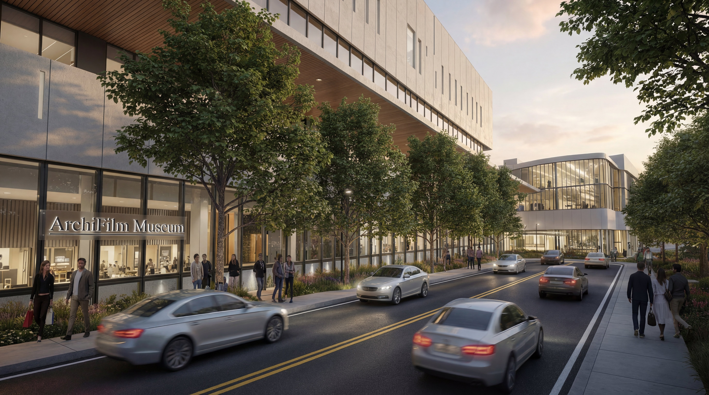
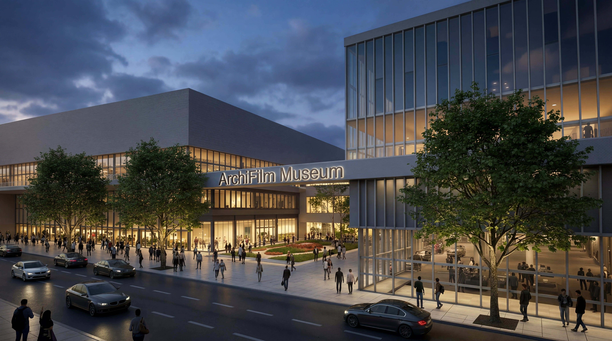
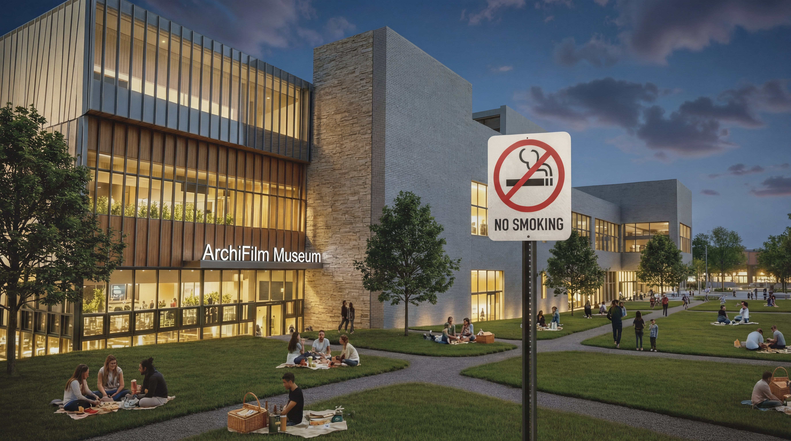
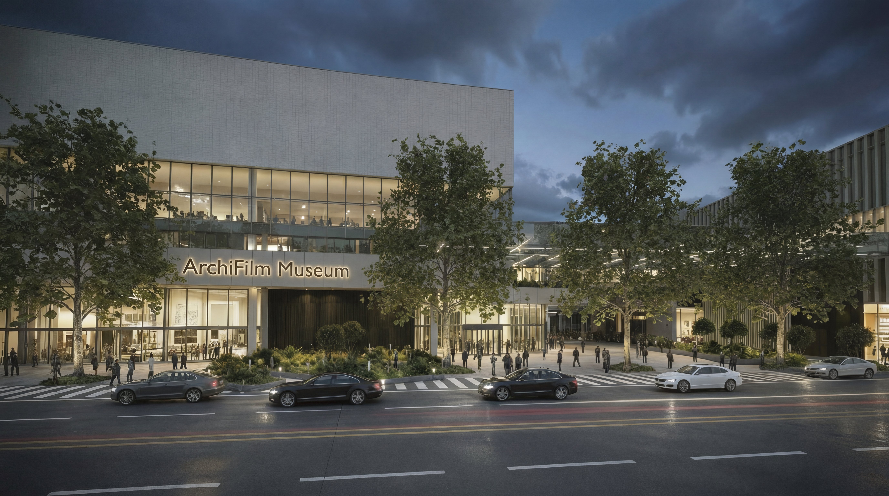
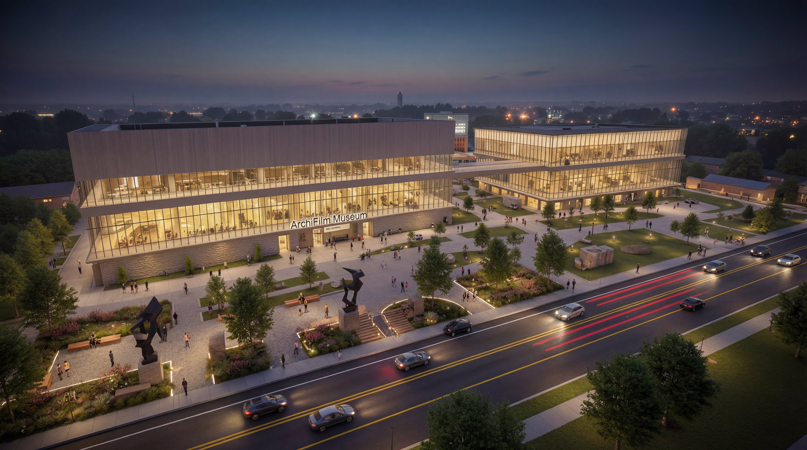

# ArchiFilm Studio - Preview


Launch Date: December 8, 2025 @ 04:00 AM (UTC) / 13:00 PM (KST)

\*\*\*\*\*

During the free preview period after launch, you can receive 100 free credits.\
However, if credits are consumed faster than expected, the preview period may end early, and the 100-credit eeeeeeeeeeeeeeeeeoffer may also be discontinued.

\*\*\*\*\*


ArchiFilm Studio is an **AI-powered rendering platform** built for architects, designers, and students who need high-quality visual results without the complexity of traditional rendering tools.\
Import models directly from **Revit and SketchUp**, describe the desired visual style using natural-language prompts, and handle image generation, editing, and smart upscaling **all in one place**.

No exporting to external software, no heavy rendering setup, no fragmented workflow.\
**Describe. Generate. Edit. Upscale. Organize.**\
Everything happens inside ArchiFilm Studio.

<figure><figcaption></figcaption></figure>

### **Key Features**

#### **1. Direct Revit & SketchUp Import**

* Preserves camera angles, perspective, and crop settings
* Instantly sends the selected view to ArchiFilm Studio Web

#### **2. Prompt-Based AI Image Generation**

* Control atmosphere, materials, lighting, and style through text descriptions
* Generate up to **three results simultaneously**

#### **3. AI Edit**

* Modify specific parts of an image with simple natural-language commands\
  (e.g., _“Change to night view,” “Remove cars,” “Add more greenery”_)
* Run up to **three edit jobs in parallel**

#### **4. Smart Upscale**

* Enhances resolution, texture, sharpness, and lighting balance
* Ideal for presentations, competitions, and portfolio-level output

#### **5. History Management**

* Manage generation / edit / upscale history in a clean visual timeline

#### **6. Prompt Booster**

* Automatically optimizes prompts for better image quality — great for users new to AI prompting.

#### **7. Multilingual Prompting**

* Understands major languages including Korean and English without manual translation.

#### **8. Multi-Task Parallel Processing**

* Generate, edit, and upscale simultaneously with no waiting between tasks.

***

### **Notes**

* Currently available as **Preview**, with ongoing improvements and feature updates
* Some unexpected variations may occur depending on model complexity or prompt detail
* Clear model structure and optimized camera views produce more stable results

## Sample Images

<figure><figcaption></figcaption></figure> <figure><figcaption></figcaption></figure>

<figure><figcaption></figcaption></figure> <figure><figcaption></figcaption></figure>

<figure><figcaption></figcaption></figure>
