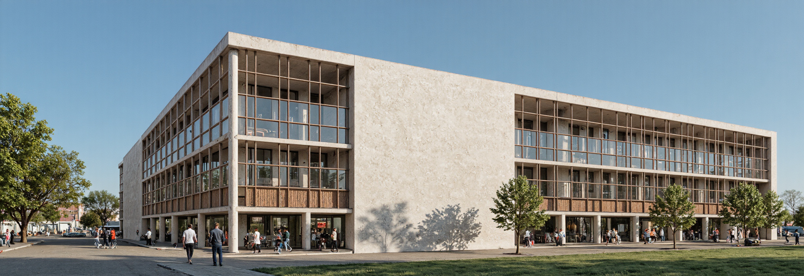
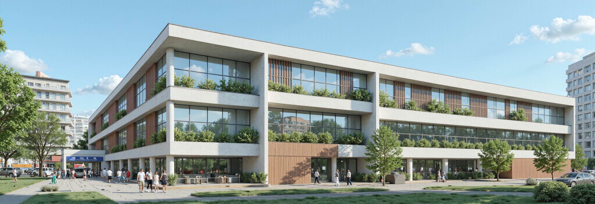
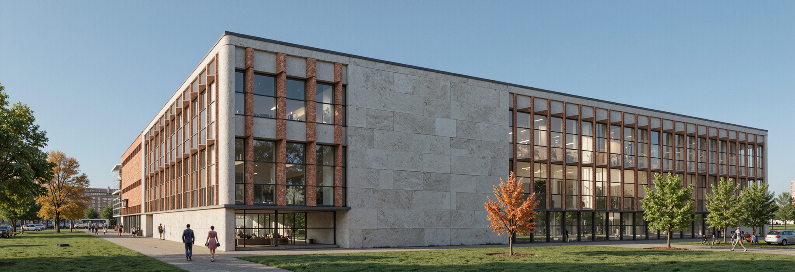
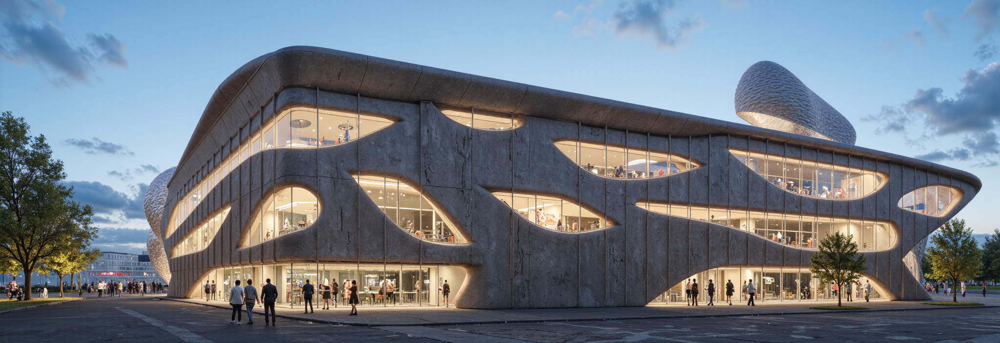

# ArchiFilm(beta) - Opening soon


ArchiFilmbeta **Open Notice**

🗓️ **Beta Test Period**\
▸ **Monday, September 1, 2025 at 4:00 AM (UTC)**\
▸ **to Tuesday, September 30, 2025 at 12:00 AM (UTC)**\
 (**KST:** June 9 at 1:00 PM \~ June 23 at 09:00 AM)


**ArchiFilm** is a smart Revit add-in that turns your 3D model views into high-quality, presentation-ready renderings—instantly. Without exporting to external software or relying on CG studios, you can now generate compelling visuals directly from your Revit scenes.

<figure><figcaption></figcaption></figure>

## **Features**

* **One-Click Rendering with Custom Prompts**\
  Render any view from your Revit model with just one click. Add prompts to describe desired atmosphere, materials, lighting, or style—ArchiFilm interprets your input to create visually appealing images without the need for manual setup.
* **Prompt Booster**\
  Unsure how to phrase your prompt? Use the built-in AI-enhancer to refine and optimize your description for better rendering results—even if you're new to visual scripting.
* **Multilingual Prompt Support**\
  Write prompts in any language. ArchiFilm uses GPT-based language models to understand and process instructions in all major languages supported by ChatGPT.
* **Preset Management**\
  Save your favorite prompts and rendering settings as **presets**. Easily reuse them across different views or projects to ensure consistency and save time.
* **Upscaling Generated Images**\
  Generated images can be upscaled to high-resolution formats—ideal for use in presentations, reports, or design deliverables.
* **ArchiFilm Hub**\
  Browse images created by other users. See which prompts and settings were used, and apply them to your own scenes for inspiration or quick testing.

### New Features

* **Image to Prompt**\
  Automatically extract descriptive prompts from an image to jumpstart your rendering process.
* **Image Reference Generation**\
  Guide your renders with reference images to achieve a specific look, mood, or style.
* **Model Reference Rendering**\
  Generate images directly referencing your Revit model for higher fidelity and accurate design output.
* **Basic Mode & Pro Mode**\
  Choose **Basic Mode** for simplified one-click control or **Pro Mode** for advanced customization, giving you flexibility based on your workflow and experience level.

## **Notes**

* Works with any 3D view currently active in Revit.
* Requires internet access for prompt processing and Hub features.
* Output quality depends on view composition and prompt clarity.

## Sample Images

<figure><figcaption></figcaption></figure>

<figure><figcaption></figcaption></figure>

<figure><figcaption></figcaption></figure>

<figure><figcaption></figcaption></figure>


**System Requirements**

* To install and use **ArchiFlim**, you must have **BIMIL version 1.1.5.0 or higher** installed.
* Please make sure you’ve updated your BIMIL before installing ArchiFlim.

&#x20;🔗 [Download BIMIL Latest version](https://bimil.bimpeers.com/)

