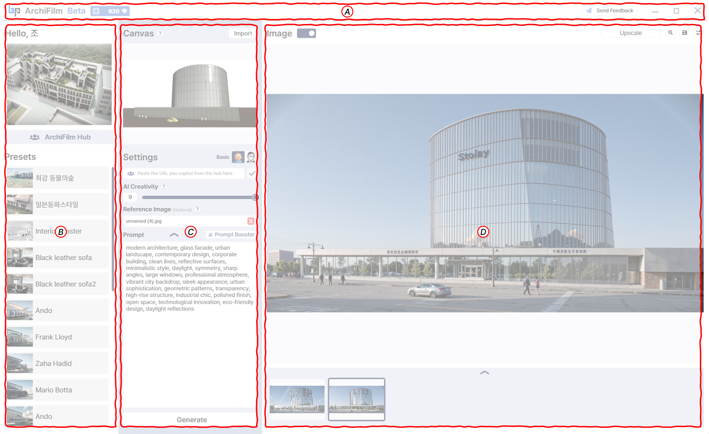

# Manual

<figure><figcaption></figcaption></figure>

Welcome to **ArchiFilm**! This guide will help you navigate the interface and understand its main features.\
The screen is divided into several key areas:

***

### (A) Top Bar

* **User Greeting & Version**: Displays a welcome message with your username (e.g., _“Hello, BIMPeers”_) and shows the current ArchiFilm version (e.g., _“Beta”_) along with available credits.
* **Send Feedback Button**: Opens the feedback window to report issues or suggest improvements.
* **Window Controls**: Standard minimize, maximize, and close buttons.

***

### (B) Left Panel

* **Hub Top Images**: A rotating showcase of the top 3 most popular images from the ArchiFilm Hub for quick inspiration.
* **ArchiFilm Hub Shortcut**: Direct access to the community gallery where you can explore images, prompts, and presets from other users.
* **Presets List**: Displays your saved presets. Clicking a preset instantly loads its stored settings into the Settings panel.

***

### (C) Center Panel

* **Canvas**: Workspace for your imported Revit 3D view. If no model is loaded, an **“Import your model”** button is displayed. You can refresh this area to update your view after changes in Revit.
* **Settings Panel**:
  * **Basic Mode**: Creativity slider, Reference Image, Prompt input, Prompt Booster.
  * **Pro Mode**: Advanced controls such as Use For (Perspective/Bird’s Eye), Render Style (Original/Creative), AI Strength, Shape Variable, and Reality.
  * Includes **Generate** to start rendering, plus options to **Reset, Apply, or Save Preset**.

***

### (D) Right Panel

* **Image Display Area**: Shows the generated rendering. Before generation, it displays a placeholder message (_“Please Generate an Image :)”_).
* **Image Controls (top right)**:
  * **Upscale** (2x, 4x, 4x HQ — HQ takes longer to process).
  * **Zoom**: View the image in larger detail.
  * **Save**: Save the generated image to your computer.
  * **Auto Save**: Option to automatically save results, with a customizable save path in Settings.
* **Gallery Preview (bottom)**: Displays thumbnails of recently generated images from the session. Clicking a thumbnail loads it into the main Image Display Area. Expanded view also provides quick access to the auto-save folder.
