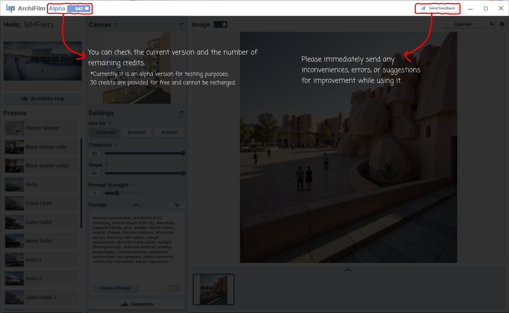

# (A) Credit, Send Feedback

<figure><figcaption>
Manual Page 2: Top Bar - Version, Credits, and Feedback
</figcaption></figure>

The Top Bar provides important information about the ArchiFilm version, your usage credits, and a way to communicate with the developers.

1. **Version and Credits Display (e.g., "ArchiFilm / Alpha / 547")**
   * **Function:** "You can check the current version and the number of remaining credits."
     * **Version (e.g., "Alpha"):** Indicates the current development stage of the software (e.g., Alpha, Beta, Release).
     * **Credits (e.g., "547"):** Shows the number of image generations or specific actions you can perform.
   * <mark style="color:red;">**Alpha Version Note:**</mark> <mark style="color:red;"></mark><mark style="color:red;">"</mark>_<mark style="color:red;">Currently, it is an alpha version for testing purposes. 30 credits are provided for free and cannot be recharged.</mark>_<mark style="color:red;">"</mark>
     * <mark style="color:red;">**Implication:**</mark> <mark style="color:red;"></mark><mark style="color:red;">This highlights that the software is in an early testing phase. The provided credits are for this test period, and there might not be an option to purchase more until a later release. Functionality and credit system may change in future versions.</mark>
2. **"Send Feedback" Button**
   * **Function:** This button opens a dialog form allowing you to communicate directly with the ArchiFilm development team.
   * **Purpose:** "Please immediately send any inconveniences, errors, or suggestions for improvement while using it."
   * **Goal:** User feedback is crucial, especially during Alpha/Beta phases, to identify bugs, usability issues, and gather ideas for new features or improvements.
