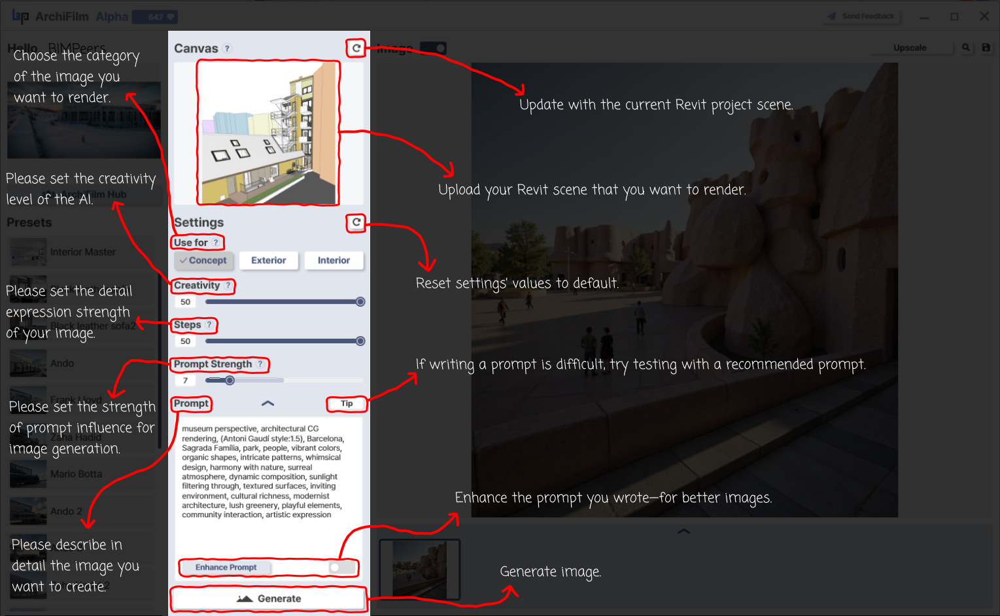

# (C) Center Panel

<figure><figcaption>
Manual Page 4: Center Panel - Defining Your Vision (Canvas &#x26; Settings)
</figcaption></figure>

The Center Panel is where you import your Revit model and Set the parameters for your desired image generation.

**Canvas Section (Top of Center Panel):**

1. **Canvas Display Area (Shows imported Revit model)**
   * **Function:** This area displays the 3D model from your currently active Revit scene once imported.
   * **Interaction:** This is your base model upon which the AI will generate the rendered image.
2. **"Import your model" (Button, typically visible before import)** / **Canvas Refresh Icon (Circled 'C' arrow icon at the top right of Canvas area)**
   * **Function (Initial Import):** If no model is loaded, a button prompts you to "Import your model."
   * **Function (Refresh):** After a model is imported, this icon allows you to "Update with the current Revit project scene." If you've made changes to your 3D view in Revit (e.g., camera angle, model changes), click this to re-import the latest view.

**Settings Section (Below Canvas):**

1. **Settings Reset Icon (Circled 'C' arrow icon at the top right of Settings section)**
   * **Function:** "Reset settings values to default." Click this to revert all sliders, prompt fields, and category selections in the Settings panel to their original default state.
2. **"Use for?" (Category Selection: Concept, Exterior, Interior)**
   * **Function:** "Choose the category of the image you want to render." Select the option that best describes your scene's context.
   * **Impact:** This helps the AI tailor its generation style and understanding for more relevant results.
3. **"Creativity" Slider**
   * **Function:** "Please set the creativity level of the AI." This slider adjusts how much artistic freedom the AI has.
   * **Impact:** Lower values produce results more faithful to standard interpretations, while higher values might introduce more novel or abstract elements.
4. **"Steps" Slider**
   * **Function:** "Please set the detail expression strength of your image." This controls the number of diffusion steps the AI takes during generation.
   * **Impact:** Generally, more steps can lead to higher detail and refinement but will take longer to generate.
5. **"Prompt Strength" Slider**
   * **Function:** "Please set the strength of prompt influence for image generation." This determines how closely the AI tries to follow your text prompt.
   * **Impact:** Higher values make the AI adhere more strictly to the prompt, while lower values give it more leeway to interpret based on the visual data and selected category.
6. **"Prompt" Text Area**
   * **Function:** "Please describe in detail the image you want to create." This is where you type the textual description of your desired output (e.g., "A modern sunlit living room with oak floors and a view of a city skyline at dusk").
   * **"Tip" Button (Lightbulb icon):** "If writing a prompt is difficult, try testing with a recommended prompt." Clicking this provide example prompts.
7. **"Enhance Prompt" Toggle Switch**
   * **Function:** "Enhance the prompt you wrote—for better images." When enabled, ArchiFilm uses an AI-based assistant to analyze and potentially rephrase or add to your prompt to improve its effectiveness for image generation.
8. **"Generate" Button**
   * **Function:** After configuring all settings and importing your model, click this button to "Generate image." This starts the rendering process.
