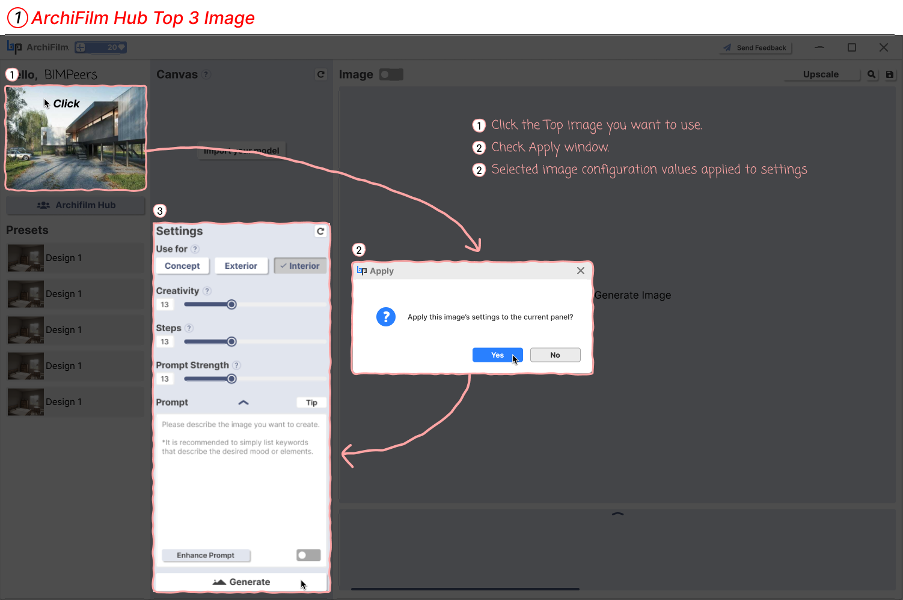

# 1. How to use top 3 Images

<figure><figcaption>
튜토리얼2.png (ArchiFilm Hub Top 3 Image - 허브 인기 이미지 사용하기)
</figcaption></figure>

You can quickly generate images by utilizing popular images from the ArchiFilm Hub.

1. **Select Image to Apply**: Click on a desired image from the popular images displayed at the top of the ArchiFilm Hub.
2. **Confirm Settings Application**: A pop-up window will appear asking, "Apply this image's settings to the current panel?"
3. **Click 'Yes'**: Clicking 'Yes' will automatically apply the settings (use for, creativity, prompt, etc.) used to generate that image to your current settings panel. You can then click the 'Generate' button to create an image.
