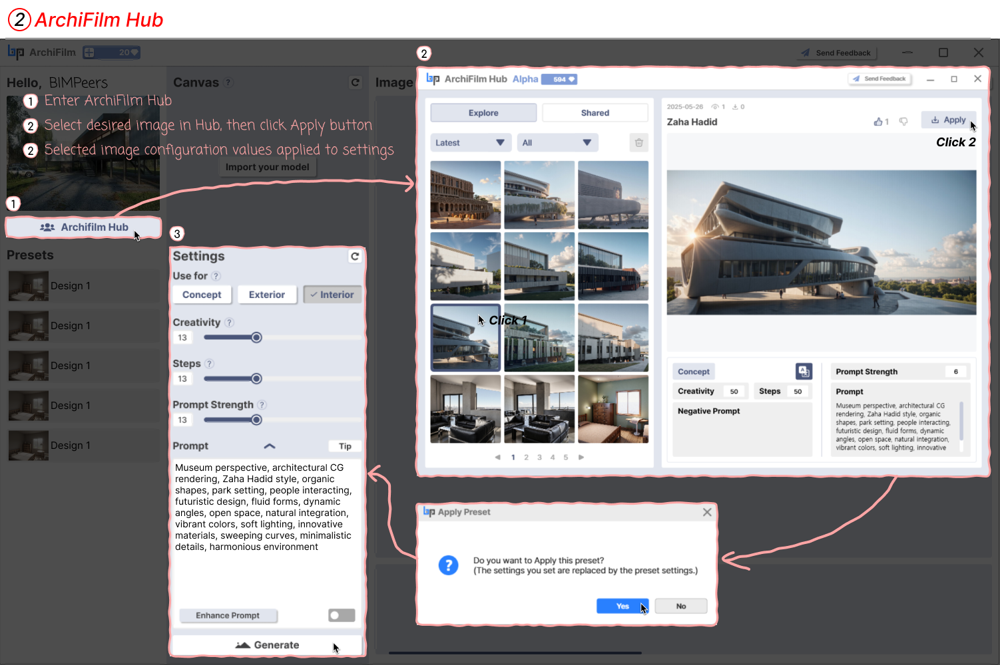

# 2. How to use ArchiFilm Hub


**Beta Hub Interface Notice.**

In the Beta version of ArchiFilm, the Hub is being renewed.

Please note that the explanations below may differ from the Beta interface.

This document will be updated accordingly.&#x20;

Thank you for your understanding.


<figure><figcaption>
ArchiFilm Hub
</figcaption></figure>

Explore various references in the ArchiFilm Hub and apply them to your work.

1. **Enter ArchiFilm Hub**: Click the 'ArchiFilm Hub' button on the left menu to open the Hub.
2. **Select Desired Image and Apply**: Choose an image you like within the Hub, then click the 'Apply' button in the upper right corner.
3. **Confirm Preset Application**: A confirmation window will appear stating, "Do you want to Apply this preset? (The settings you set are replaced by the preset settings.)" Click 'Yes' to automatically reflect the selected image's settings in your workspace's 'Settings' panel.
