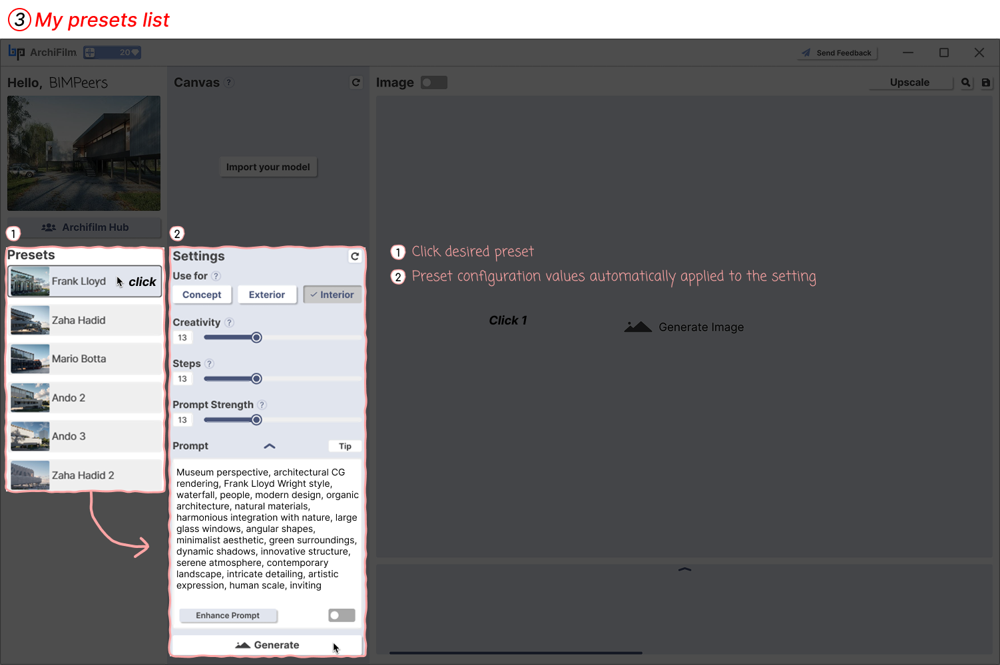

# 3. How to use Presets

<figure><figcaption>
(My presets list - 내 프리셋 목록 활용하기)
</figcaption></figure>

Save and manage frequently used settings as presets to increase work efficiency.

1. **Click Desired Preset**: Click the preset you want to use (e.g., Frank Lloyd, Zaha Hadid, etc.) from the 'Presets' list on the left.
2. **Settings Automatically Applied**: The settings values (use for, creativity, steps, prompt strength, prompt content, etc.) saved in the clicked preset are automatically entered and adjusted in the 'Settings' panel on the right. You can then immediately click the 'Generate' button to create an image.
