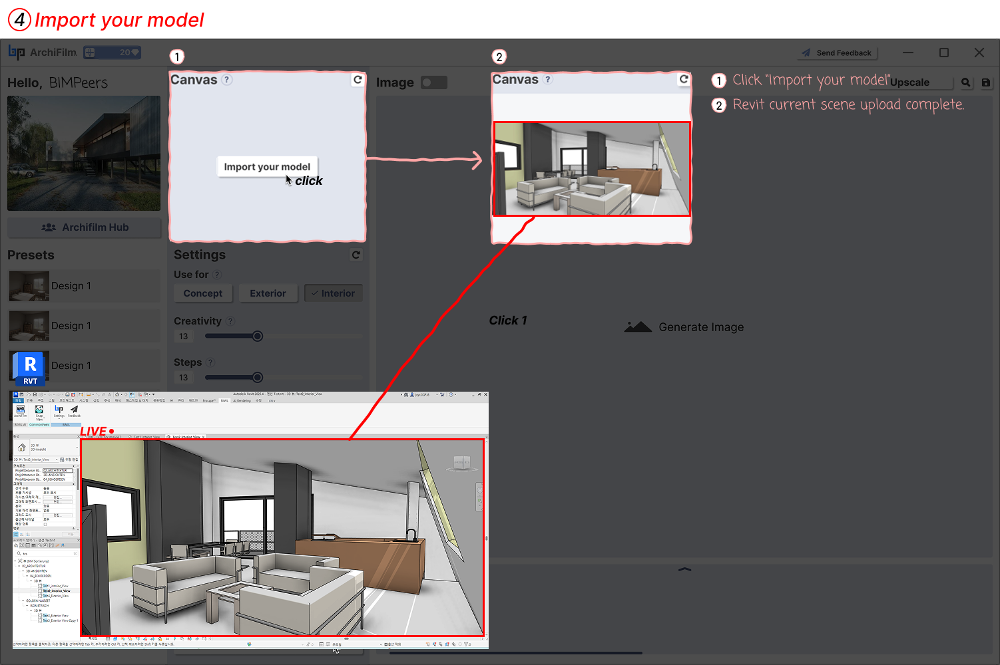

# 4. How to use Canvas

<figure><figcaption>
Canvas
</figcaption></figure>

Import the 3D view you are currently working on in Revit into ArchiFilm to prepare for rendering.

1. **Click 'Import your model'**: Click the 'Import your model' button in the 'Canvas' area in the center of the ArchiFilm interface.
2. **Upload Current Revit View**: When clicked, the currently active 3D view in Revit will be loaded and displayed in ArchiFilm's 'Canvas' area. You can now adjust settings and generate images based on this view. (The Revit screen at the bottom is an example showing the original view to be imported into ArchiFilm.)

> **Tip**
>
> Before importing your model, setting your view as below will help the AI generate better images!\
>

<figure><figcaption></figcaption></figure>
