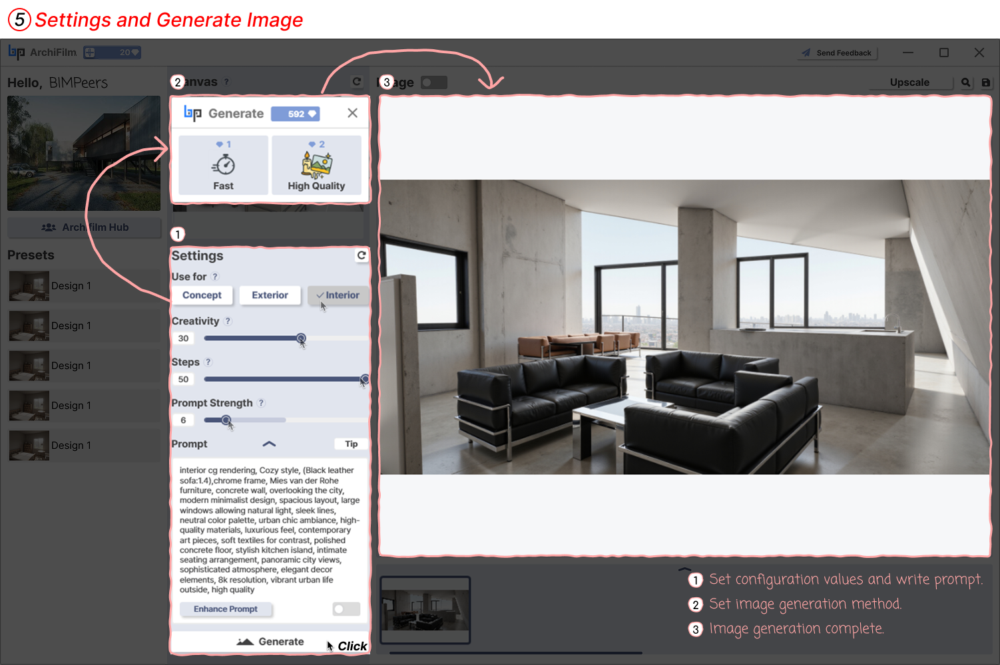

# 5. How to Generate

<figure><figcaption>
Generate Image
</figcaption></figure>

Adjust detailed settings based on the imported model and generate the image.

1. **Configure Settings and Write Prompt**:
   * **Use for?**: Select the primary purpose of the image (Concept, Exterior, Interior, etc.).
   * **Creativity**: Adjust the creativity level of the output (0-50).
   * **Steps**: Adjust the number of image generation steps. Higher values may increase detail (0-50).
   * **Prompt Strength**: Adjust how much influence your input prompt has on the result (0-50).
   * **Prompt**: Enter text describing the desired mood, style, materials, lighting, etc., for the image you want to create (e.g., "Interior cg rendering, Cozy style...").
   * **Enhance Prompt**: When you press the "Enhance Promp&#x74;**"** button, the toggle button activates and optimizes your input prompt.
2. **Click 'Generate', Select Generation Mode, and Complete Image Generation:**
   1. Once all setting values are configured and the prompt is written, click the 'Generate' button.
   2. When you click the 'Generate' button, a new window will appear where you can select the image generation mode.
   3. In the new window, choose an image generation option such as 'Fast' or 'High Quality'. Each option may consume a different amount of credits (e.g., Fast mode might cost 1 credit, High Quality mode might cost 2 credits).
   4. Select your desired mode and confirm (or click the start generation button) in that window. Image generation will then begin, and after a moment, the final result will appear in the 'Image' display area.
