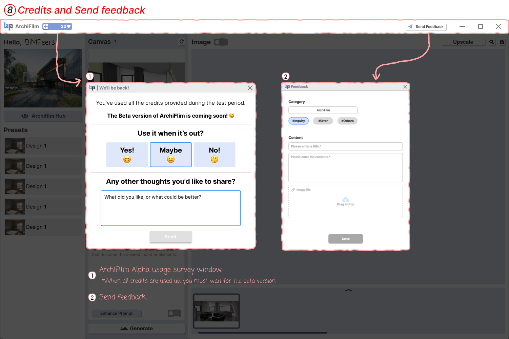

# 8. How to use Credits, Feedback

<figure><figcaption>
Credits and Send feedback
</figcaption></figure>

Check information about credits required for program use and send any issues or improvement ideas to the development team.

1. **ArchiFilm Alpha Usage Survey Window (When credits are used up)**:
   * If you use all credits provided during the test period, a message will appear: "You've used all the credits provided during the test period. The Beta version of ArchiFilm is coming soon!"
   * When all credits are used up, you must wait for the beta version.
2. **Send feedback**:
   * Click the 'Send Feedback' button in the upper right corner of the interface to open the feedback submission window.
   * **Category**: Select the type of feedback (ArchiFilm, #Inquiry, #Error, #Others).
   * **Content**: Enter a Title and detailed Contents.
   * **Image file**: If necessary, you can attach relevant image files by dragging and dropping.
   * Click the 'Send' button to submit your feedback.
