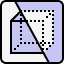

# Toggle Section Box

<figure><figcaption></figcaption></figure>

The **Toggle Section Box** feature enables users to easily generate or hide section boxes with a single click, based on the selected element(s). This functionality combines box creation and toggling into one convenient tool, maximizing ease of use.

## **Box Generation / Hiding Conditions**

### **Generate Box**

* **When element(s) are selected**: Creates a section box around the selected element(s) (excluding the section box itself).
* **When no elements are selected and the section box is inactive**: Restores the last used section box in the current view.

### **Hide Box**

* **When a section box already exists based on the currently selected elements**
* **When no elements are selected and the section box is active**
* **When only the section box is selected**

## **Section Box Creation Rules**

The size, and other generation rules for section boxes can be configured under [**Manage Section Box - Settings**](manage-seciton-box-settings.md).
