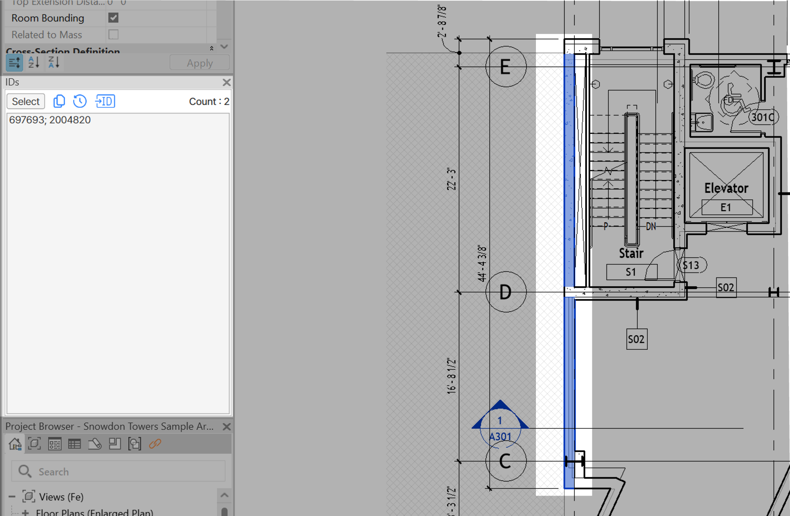

# How to Use

#### 1️⃣ Click IDs

* Go to the **BIMIL** tab and click the **IDs** icon.

#### 2️⃣ Select Elements

* &#x20;Select the elements in the model whose IDs you want to check.

#### 3️⃣ View IDs

* In the **IDs window**, the **Element IDs** of the selected objects will be displayed.

<figure><figcaption></figcaption></figure>

### UI Features

<figure><figcaption></figcaption></figure>

1. **Select**
   * Enter known element IDs in the input box and click **Select**.\
     → The corresponding elements will be highlighted in the model.
   * Selected IDs are also saved in **History** for later use.
2. **Copy**
   * Copies all listed IDs in the text box to the clipboard.
3.  **History**

    * Opens the **History window**, which stores up to the last 20 selections.
    * You can re-select IDs directly from history to quickly locate elements again.
    *

        
<figure><figcaption></figcaption></figure>

4. **Insert ID into Parameter (✨New Feature)**
   * Allows you to insert selected element IDs into a chosen project parameter.
   * Select a parameter (e.g., Finish, Material, Occupant) and click **Apply**.
     * &#x20;Elements without the parameter will be skipped.
     * &#x20;Existing values in the parameter will be overwritten.
     *

         
<figure><figcaption></figcaption></figure>

