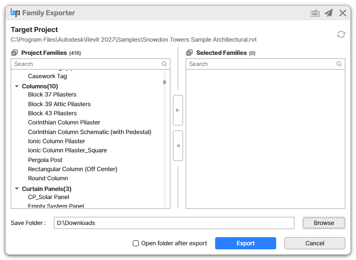

# How to Use

### 1. Start Family Exporter

* Open the **BIMIL** tab in Revit and click **Family Exporter**.
* The add-in loads families from the active project and displays the project path under **Target Project**.


If the project has not been saved yet, the target project is shown as `New Project (Project Name)`.


<figure><figcaption></figcaption></figure>

### 2. Review Project Families

The left panel, **Project Families**, shows loaded families grouped by category. Each category group displays the number of families it contains.

* Use **Search** to filter families by family name.
* Use the expand/collapse button to open or close all category groups.

### 3. Select Families

Select the families or category groups you want to export.

* **Single Selection:** Click a single family to select it.
* **Multiple Selection:** Use `Ctrl + Click` to select multiple individual items.
* **Range Selection:** Use `Shift + Click` to select a range of items.
* **Select All:** Use `Ctrl + A` to select all visible items in the focused list.

### 4. Move Families to Selected List

Move or remove items between the lists using the arrow buttons located in the center.

* **Add to Export List:** Select items from **Project Families** (left list) and click the **\[ > ] (Right Arrow)** button to move them to **Selected Families**.
* **Remove from Export List:** Select items from **Selected Families** (right list) and click the **\[ < ] (Left Arrow)** button to remove them.

### 5. Choose a Save Folder

Click **Browse** and select the folder where the exported RFA files will be saved.

The default save folder is:

```
Desktop\Family Exporter
```

### 6. Export Families

Click **Export** to save the selected families as `.rfa` files.

Family Exporter creates category folders automatically inside the selected save folder.

```
Save Folder
+-- Doors
|   `-- FamilyName.rfa
+-- Furniture
|   `-- FamilyName.rfa
`-- Windows
    `-- FamilyName.rfa
```

Enable **Open folder after export** if you want the output folder to open automatically after the export is complete.

### 7. Check Export Results

When export is complete, Family Exporter shows a result message.

* If all selected families are exported successfully, the message shows the number of exported families.
* If some families cannot be exported, the message lists the failed families.
* Successfully exported families are removed from the **Selected Families** list.
