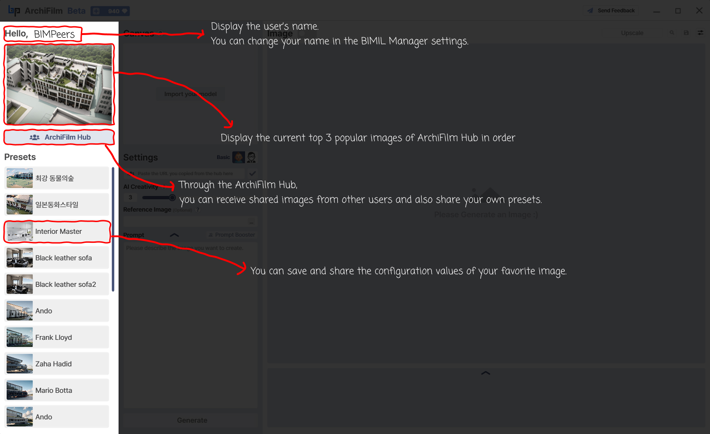

# (B) Hub, Preset List

<figure><figcaption></figcaption></figure>

The Left Panel is designed to provide quick access to inspiration and your saved workflows.

1. **User Greeting ("Hello, BIMPeers")**
   * **Function:** Displays the currently logged-in user's name.
   * **Note:** Your display name can typically be changed within your main BIMIL Manager account settings
2. **Hub Top Image Display (Image cycler below user greeting)**
   * **Function:** This area automatically cycles through the current top 3 most popular or featured images from the ArchiFilm Hub.
   * **Goal:** Provides instant visual inspiration and showcases the capabilities of ArchiFilm. Clicking on these images may load their settings as a starting point.
3. **"ArchiFilm Hub" Button**
   * **Function:** Clicking this button opens the ArchiFilm Hub.
   * **Hub Purpose:** The Hub is a community platform where you can:
     * **Receive shared images:** Browse and import images and their settings (prompts, parameters) created by other ArchiFilm users.
     * **Share your own presets:** Contribute your successful rendering settings to the community.
   * **Goal:** Fosters a collaborative environment, accelerates learning, and provides a rich library of starting points for new renderings.
4. **"Presets" List (e.g., Interior Master, Black leather sofa, Ando, Frank Lloyd)**
   * **Function:** This list displays all your saved presets. A preset stores a specific combination of settings (Use for, Creativity, Steps, Prompt Strength, and the Prompt text itself).
   * **Usage:** Clicking a preset instantly applies its saved configuration values to the "Settings" panel.
   * **Goal:** Allows you to save and quickly re-apply your favorite or frequently used rendering configurations, ensuring consistency and saving time. You can also share these presets (potentially through the Hub).
