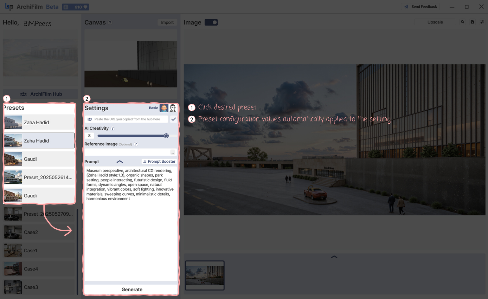

# 4. How to use Presets

<figure><figcaption></figcaption></figure>

You can save and manage frequently used settings as **presets** to increase work efficiency.

***

### Click Desired Preset

* From the **Presets list** on the left (e.g., _Frank Lloyd, Zaha Hadid, Mario Botta_), click the preset you want to use.

***

### Settings Automatically Applied

* The saved values (use for, creativity, steps, prompt strength, prompt content, etc.) in the selected preset are automatically loaded into the **Settings panel** on the right.
* After the preset is applied, you can immediately click the **Generate** button to create an image based on those settings.
