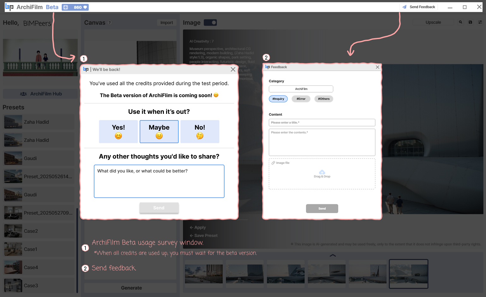

# 6. How to use Credits, Feedback

<figure><figcaption></figcaption></figure>

You can check information about credits required for program use and send any issues or improvement ideas to the development team.

***

### ArchiFilm Alpha Usage Survey Window (When credits are used up)

* If you use all credits provided during the test period, a message will appear:\
  &#xNAN;_“You’ve used all the credits provided during the test period. The Beta version of ArchiFilm is coming soon!”_
* At this point, no additional generations can be performed, and you must wait for the Beta version to become available.
* The survey window may also ask: _“Use it when it’s out?”_ with options to answer **Yes, Maybe, or No**, along with an open text field to share feedback about what you liked or what could be improved.

***

### Send Feedback

* Click the **Send Feedback** button in the upper-right corner of the interface to open the feedback submission window.
* **Category**: Select the type of feedback (e.g., ArchiFilm, #Inquiry, #Error, #Others).
* **Content**: Enter a title and provide detailed feedback in the text field.
* **Image file**: If needed, attach relevant screenshots or reference images by dragging and dropping them into the upload area.
* **Submit**: Click the **Send** button to deliver your feedback directly to the development team.
