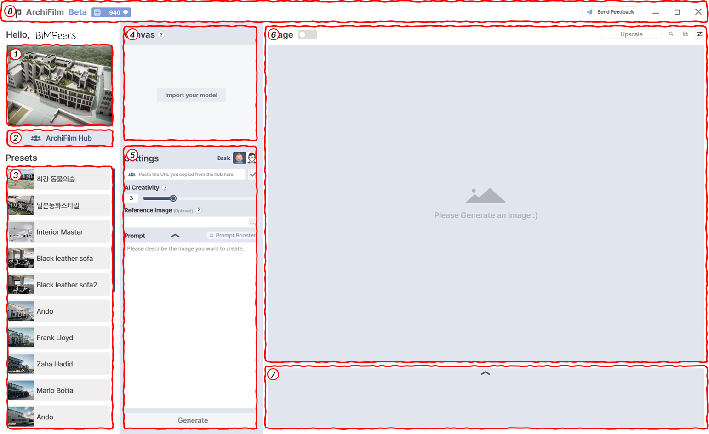

# Tutorial

<figure><figcaption></figcaption></figure>

This is the **basic interface of ArchiFilm**. Each numbered area corresponds to the following functions:

***

#### ① Hub’s Top 3 Images Display

* Displays the **top 3 most popular images** from the ArchiFilm Hub.
* The images rotate periodically to provide quick inspiration.

***

#### ② ArchiFilm Hub Shortcut

* Direct link to the **ArchiFilm Hub**.
* Browse images, prompts, and presets created by other users.

***

#### ③ Presets List

* Shows your **saved presets**.
* Clicking a preset automatically loads its stored settings into the Settings panel for immediate use.

***

#### ④ Canvas

* Workspace where the **imported 3D view from Revit** is displayed.
* If no model is loaded, this area shows the **“Import your model”** button.

***

#### ⑤ Settings

* Adjust parameters for image generation.
* **Basic Mode**: Creativity, Reference Image, Prompt, Prompt Booster.
* **Pro Mode**: Use for (Perspective/Bird’s Eye), Render Style (Original/Creative), AI Strength, Shape Variable, Reality.
* Includes **Reset** (restore defaults), **Apply**, and **Save Preset** functions.

***

#### ⑥ Image Display Area

* Displays the **generated image** or an image selected from the Hub.
* Before generation, shows a placeholder: _“Please Generate an Image :)”_
* Includes controls such as **Upscale, Zoom, Save**, and **Auto Save option**.

***

#### ⑦ Gallery Preview

* Shows thumbnail previews of recently generated images in the current session.
* Clicking a thumbnail displays it in the main Image Display Area.
* Expanded view provides a shortcut to the **Auto Save folder**.

***

#### ⑧ Top Bar (Credits & Feedback)

* Displays your current **credits** (e.g., _“940”_).
* Shows your logged-in **user name** (e.g., _“Hello, BIMPeers”_).
* Provides a **Send Feedback** button to share inquiries, errors, or suggestions with the development team.

