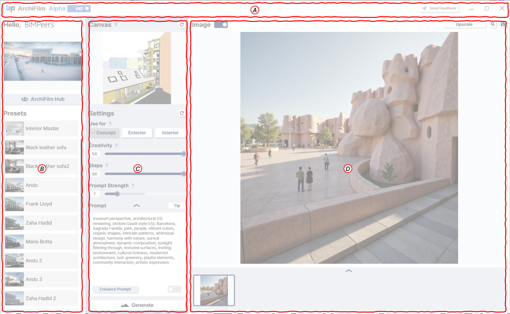

# Manual

<figure><figcaption>
Manual Page 1: ArchiFilm Main Interface Overview
</figcaption></figure>

Welcome to ArchiFilm! This manual will guide you through its interface and features. The main screen is divided into several key areas:

**(A) Top Bar:**

* **User Greeting & Version:** Displays a welcome message with your username (e.g., "Hello, BIMPeers") and shows the current ArchiFilm version (e.g., "Alpha") along with your available credits.
* **Send Feedback Button:** Allows you to report issues or suggest improvements.
* **Window Controls:** Standard window controls (minimize, maximize, close).

**(B) Left Panel:**

* **Hub Top Image Display:** Showcases a rotating selection of popular images from the ArchiFilm Hub, offering quick inspiration.
* **ArchiFilm Hub Button:** Provides access to a community gallery where you can explore images created by other users and share your own.
* **Presets List:** Contains your saved rendering settings (prompts, style parameters, etc.) for quick reuse across different projects or views.

**(C) Center Panel:**

* **Canvas Tab:** This is where your active Revit 3D view is imported and displayed. You can refresh this view if you make changes in Revit.
* **Settings Section:**
  * **Use for?:** Define the category of your render (e.g., Concept, Exterior, Interior).
  * **Creativity Slider:** Controls the level of artistic interpretation by the AI.
  * **Steps Slider:** Adjusts the number of diffusion steps, impacting detail and generation time.
  * **Prompt Strength Slider:** Determines how strictly the AI adheres to your text prompt.
  * **Prompt Text Area:** Input your desired scene description, including atmosphere, materials, lighting, and style. A 'Tip' button offers guidance.
  * **Enhance Prompt Toggle:** An AI-powered feature to refine and optimize your text prompt for better results.
  * **Generate Button:** Initiates the image rendering process based on your imported view and current settings.

**(D)  Right Panel:**

* **Image Tab (Main Right Area):** Displays the generated rendering. A "Generate Image" placeholder text might be shown before an image is loaded or created.
* **Image Controls (Top right of the Image Tab):**
  * **Upscale Button:** Allows you to increase the resolution of the generated image to create high-quality visuals.
  * **Image Zoom Button:** Displays the generated image enlarged for more detailed viewing.
  * **Save Button:** Allows you to save the generated image as a file to your computer.
* **Bottom Gallery Preview (Below the Image Tab):** Shows thumbnails of recently generated images from the current session in a horizontally scrollable strip.

### This overview provides a general understanding of where to find ArchiFilm's tools and features. Subsequent pages will detail each section.
