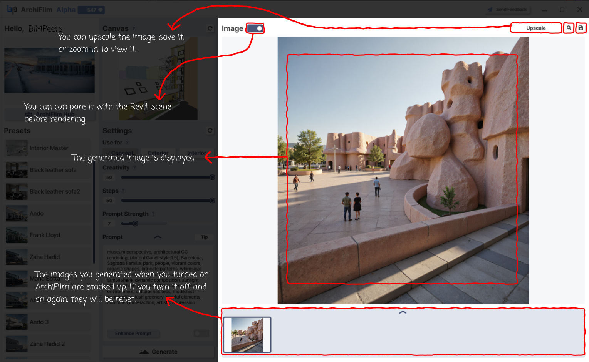

# (D) Image, Gallery

<figure><figcaption>
Manual Page 5: Right Panel - Viewing and Managing Your Creations
</figcaption></figure>

This section explains how your generated images are displayed and managed.

**Right Panel - Image Display Area:**

* **Image Display and Comparison Feature:**
  * **Function:** After the generation process is complete, "the generated image is displayed here."
  * **'Image' Tab and Comparison Toggle Button:** Next to the 'Image' tab label, there is a **toggle button**. This key feature helps users easily compare the scene before and after AI generation.
    * **When the toggle is activated:** The final AI-generated image is displayed.
    * **When the toggle is deactivated:** The previous Revit model scene, which was the basis for the rendering, is displayed.
  * **Goal:** Users can instantly switch between the original model and the AI result by simply flicking this toggle, allowing for immediate comparison.
* **Image Controls (Top right of the Image Display Area):**
  * These controls are used to manage and utilize the generated images.
  * **Upscale Button:** Increases the resolution of the currently displayed generated image, making it suitable for print-quality or presentation visuals.
  * **Zoom Button (Magnifying glass icon):** Opens the current image **enlarged in a separate new window**, allowing for a more detailed and closer examination of its specifics.
  * **Save Button:** Saves the currently displayed generated image as an image file to your computer.

**Bottom Gallery Preview (Horizontal strip at the bottom of the interface):**

* **Image Stacking Feature:** "Images you generated while ArchiFilm is running are stacked up as thumbnails in this gallery area." This provides a concise visual history of your creations within the current session.
* **Operation and Auto-Save:** While the list of thumbnails in this gallery preview might be reset when you restart the program, all generated images are <mark style="color:red;">**automatically saved to the 'BIMIL\ArchiFilm' folder located within your user's Documents folder.**</mark> Therefore, you can always find your previous work in that specific folder.\
  _\*Clicking the__&#x20;__**up arrow button (gallery expansion)**__&#x20;__in the gallery preview area will expand the gallery. When expanded,__&#x20;__**a button that provides a direct shortcut to the auto-save folder will appear next to the 'Gallery' title.**_
* **Interaction:** Clicking a thumbnail in this gallery will typically display that image in the main "Image Display Area" above.
