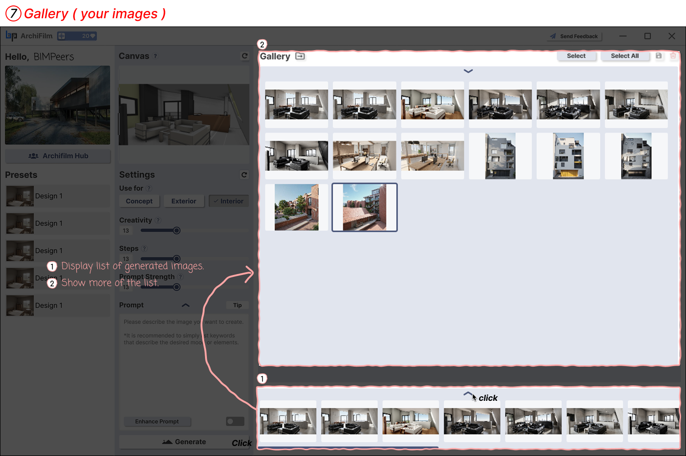

# 7. How to use Gallery

<figure><figcaption>
Gallery
</figcaption></figure>

You can view and manage all the images you have generated so far.

1. **Display List of Generated Images**: By clicking the bottom bar area(in the image, it appears the bottom bar was clicked to expand), a list (gallery) of images you've created will expand and appear.
2. **Show More of the List / Select Image**:
   * You can manage images using the 'Select' and 'Select All' buttons in the upper right corner of the gallery window.
   * Use scroll to see more generated images. The selected image will be displayed prominently in the central 'Image' area.
