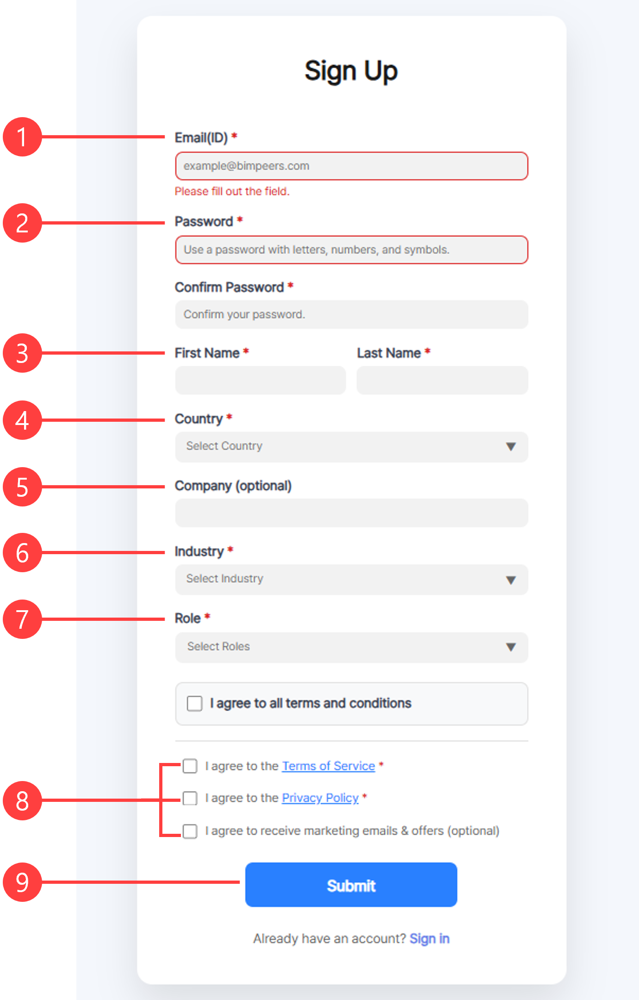

# Sign-up

If you've signed up, let's move on to [the next step](log-in.md)!


Please check your **internet connection**.&#x20;


1. **ID (Email)** : \
   \- Enter your valid **email address**. A verification code will be sent to this email, so ensure the email is accurate.
2. **Password** : \
   \- Create your password. Re-enter the same password in the field below to confirm.
3. **First Name / Last Name** :\
   \- Enter your First Name / Last Name.&#x20;
4. **Country :**\
   **-** Select your country from the dropdown list.
5. **Company (optional)** : \
   \- Enter your company name (optional). You can leave this blank if you are not affiliated with a company. This field is also optional.
6. **Industry :**\
   **-** Select your industry from the dropdown list (e.g., Architecture, Engineering, Construction).
7. **Role** :\
   \- Choose your role (e.g., Staff, Manager, Team Leader, CEO, etc.).
8. **Agreement** : \
   \- **Terms and Service** :  You must agree to the terms and conditions.\
   \- **Privacy Policy** :  You must agree to the privacy policy.\
   \- Marketing Emails(optional) : Opt-in to receive marketing emails and offers.
9. **Submit** Button : \
   \- Once all required fields are filled and agreements are checked, click **Submit** to complete the sign-up process.\
   \- If you already have an account, click **Sign In** at the bottom of the page.

<figure><figcaption></figcaption></figure>

10. **Verification Code**\
    \- Enter the verification code you received **via email**. You will receive the code at the email address you entered in Marker ❶.
11. **Submit** Button : \
    \- After entering the verification code, click the Submit button to complete the verification process.
12. Resend Email : \
    \- If you didn't receive the email, click the Resend Email link to receive the verification code again.

<figure><figcaption></figcaption></figure>

13. The "Registration Complete" message indicates that your registration has been successfully completed.

<figure><figcaption></figcaption></figure>
