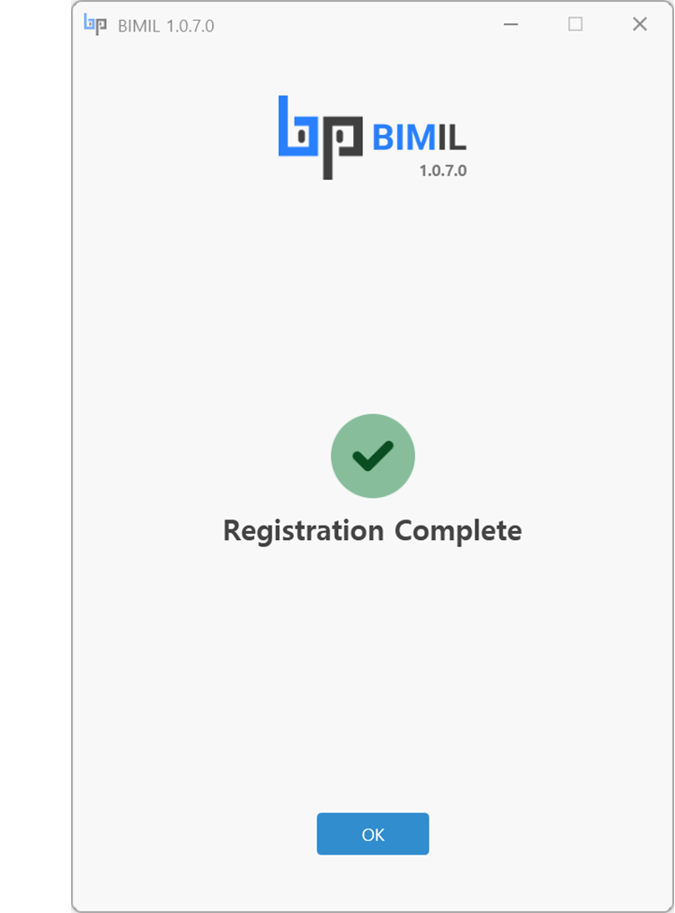

# Sign-up

If you've signed up, let's move on to [the next step](log-in.md)!


Please check your **internet connection**.&#x20;


1. **ID (Email)** : \
   \- Enter your valid **email address**. A verification code will be sent to this email, so ensure the email is accurate.
2. **Password** : \
   \- Create your password. Re-enter the same password in the field below to confirm.
3. **First Name / Last Name** :\
   \- Enter your First Name / Last Name.&#x20;
4. **Company (optional)** : \
   \- Enter your company name (optional). You can leave this blank if you are not affiliated with a company.
5. **Role (optional)** :\
   \- Enter your role (e.g., Staff, Manager, Team Leader, CEO, etc.). This field is also optional.
6. **Agreement** : \
   \- **Terms and Service** :  You must agree to the terms and conditions.\
   \- **Privacy Policy** :  You must agree to the privacy policy.\
   \- Marketing Emails(optional) : Opt-in to receive marketing emails and offers.
7. **Submit** Button : \
   \- After filling out all the required fields and agreeing to the terms, click the Submit button to proceed.

<figure><figcaption></figcaption></figure>

8. **Verification Code**\
   \- Enter the verification code you received **via email**. You will receive the code at the email address you entered in Marker ❶.
9. **Submit** Button : \
   \- After entering the verification code, click the Submit button to complete the verification process.
10. Resend Email : \
    \- If you didn't receive the email, click the Resend Email link to receive the verification code again.

<figure><figcaption></figcaption></figure>

11. The "Registration Complete" message indicates that your registration has been successfully completed.

<figure><figcaption></figcaption></figure>
