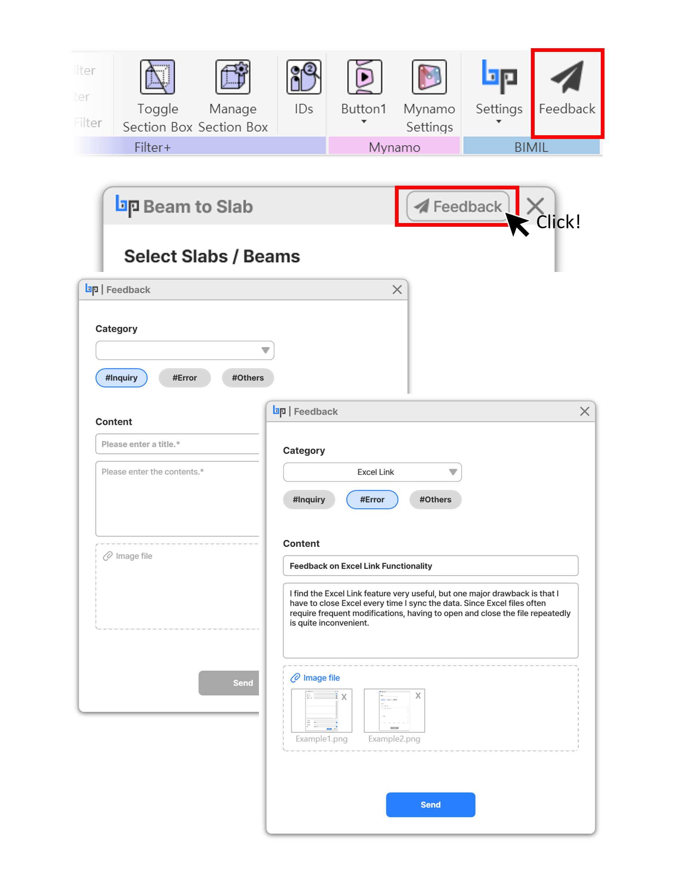

# 25-03-14

## BIMIL Update: New Feedback Feature 🚀

We’re excited to introduce the latest updates to **BIMIL**! 🎉 However, please note that there will be a **temporary service downtime** due to scheduled maintenance.

***

## 🛠 Scheduled Maintenance

📅 **Date:** March 17, 2025\
⏰ **Time:**\
&#xNAN;**- 3:00 AM – 4:00 AM UTC**\
&#xNAN;**- 12:00 PM – 1:00 PM KST (Korea Standard Time)**

During this time, BIMIL services may be temporarily unavailable.\
We apologize for any inconvenience and appreciate your understanding.

***

## What’s New?

### ✅ **New Feedback Button**

* Have an issue or suggestion? Now, you can send feedback directly from Revit without writing an email!
* Just click the button, type your message, and hit **Send** – quick and easy!

### ✅ **Excel Link Add-in Bug Fixes**

* Fixed issues where **cell merging** was not working correctly.
* Fixed **borders** not displaying properly for merged cells.\
  Now, your exports will be cleaner and more accurate!

***

### 📌 **Where to Find the Feedback Button?**

1️⃣ **BIMIL Group Ribbon Menu** – Find the **Feedback** button in the top menu bar.\
2️⃣ **Each Add-in Window** – A **Feedback** button is also available in the **top-right corner** of every Add-in window.

### 📌 **How to Use It?**

1. Click the **Feedback** button.
2. Select a category (**Inquiry, Error, Others**).
3. Describe the issue or suggestion.
4. (Optional) Attach screenshots for better clarity.
5. Click **Send** – done!

<figure><figcaption></figcaption></figure>

Try the new feature and let us know what you think! Your feedback helps us improve BIMIL for everyone.
