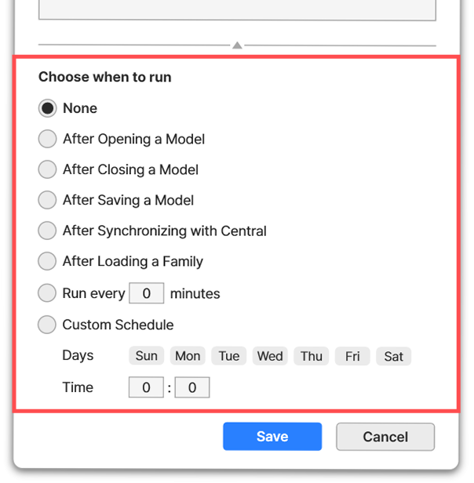

# 25-06-20

## ✨Major BIMIL Update - Coming June 23✨

A major BIMIL update is coming on Monday, June 23, 2025 — and you’re going to want to be there when it drops.

This update will include:

***

### 📌 What’s Coming?

✔️ **Support for Revit 2026**



✔️ **Auto Tag(Add-in) Enhancements**

・ Customize **font** and **line spacing**\
・ Add **thickness prefix options** (e.g., THK 200)



<figure><figcaption></figcaption></figure>





**✔️ Mynamo(Add-in) Enhancements**

・Now supports **triggers**, allowing more advanced control over your visual workflows



<figure><figcaption></figcaption></figure>





✔️ BIMIL Add-in Manager Improvements

・New \[Update All] button to update all installed add-ins at once

・Refresh your add-in list to detect available updates — no need to restart BIMIL

・New “My Add-ins” tab – manage only the add-ins you’ve installed, in one place!



<figure><figcaption></figcaption></figure>



***

### 🗓 Update Release Schedule

Release Time:
\
▸Monday, June 23, 2025 at 4:00 AM (UTC)
\
▸Monday, June 23, 2025 at 1:00 PM (KST)

Maintenance Window:
\
▸June 23, 3:00–4:00 AM (UTC) | 12:00–1:00 PM (KST)
\
※ BIMIL may be temporarily unavailable during this time.

***

### ⚠️ Reminder: ArchiFlim Alpha ver. Ends Soon

The ArchiFlim Alpha Test will end at
\
12:00 AM (UTC), June 23 | 9:00 AM (KST), June 23

🚫 Your 30 free credits will expire and cannot be reused after this time.

👉 Haven’t tried ArchiFlim yet? [Check out the full guide and give it a go.](../../archi-film/)

***

We’re thrilled to share this next step with you.\
If you have any questions or need support, feel free to reach out at [help@bimpeers.com](mailto:help@bimpeers.com?subject=undefined\&body=undefined).

Best regards,

The **BIMIL** Team
