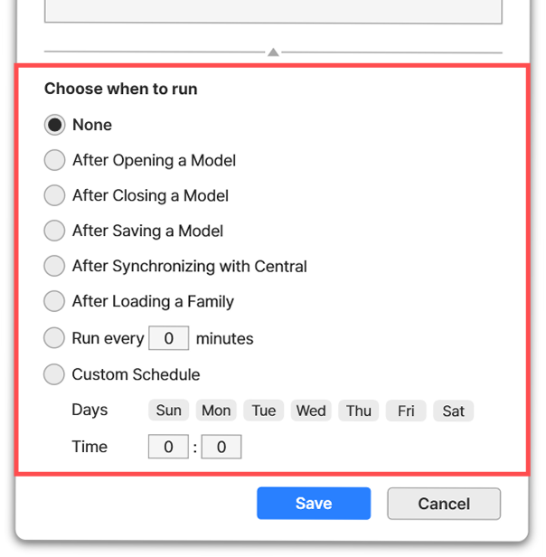

# 25-06-23

## ✨Major BIMIL Update Is Here✨

We’re excited to share that the **June 23 BIMIL update is now live!** 🎉\
And yes — **BIMIL is now fully ready for Revit 2026**.

Here’s a quick look at what’s new:

***

### 📌 What’s Coming?

#### ✔️ **Support for Revit 2026**



#### ✔️ **Auto Tag(Add-in) Enhancements**

・ Customize **font** and **line spacing**\
・ Add **thickness prefix options** (e.g., THK 200)



<figure><figcaption></figcaption></figure>





#### **✔️ Mynamo(Add-in) Enhancements**

・Now supports **triggers**, allowing more advanced control over your visual workflows



<figure><figcaption></figcaption></figure>





#### ✔️ BIMIL Add-in Manager Improvements

・New \[Update All] button to update all installed add-ins at once

・Refresh your add-in list to detect available updates — no need to restart BIMIL

・New “My Add-ins” tab – manage only the add-ins you’ve installed, in one place!



<figure><figcaption></figcaption></figure>





#### 📎 **Note:**

The **Excel Link** add-in has been relocated from the **ArchiPeers** group to the **CommonPeers** group for better organization.



<figure><figcaption></figcaption></figure>



***

### 📌 **ArchiFlim Alpha ver. Test Has Ended**

The ArchiFlim Alpha has officially concluded.\
**Thank you** to everyone who participated and shared feedback — it was incredibly valuable.\
We’re now working hard on the **Beta version**, so stay tuned for what’s next!

***

If you have any questions or need support, feel free to reach out at [help@bimpeers.com](mailto:help@bimpeers.com?subject=undefined\&body=undefined).

Thanks for being part of the BIMIL journey!\

Best regards,

The **BIMIL** Team
