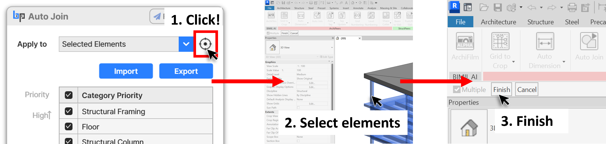

# 25-07-08

## Auto Join, Auto Tag & Beam To Slab Update!✨

We’re excited to announce the latest updates for three of your essential tools: **Auto Join**, **Auto Tag**, and **Beam To Slab**!

***

### ✨ What's New?

<figure><figcaption></figcaption></figure>

\-  UI & UX update\
: Previously, you had to close the add-in window to pick elements in the model. Now, simply click the new right-side “🎯” button while the add-in is open, and choose elements directly without hiding the UI.

<figure><figcaption></figcaption></figure>

<figure><figcaption></figcaption></figure>

\-  Bug fixes\
\-  UI/UX Enhanced

<figure><figcaption></figcaption></figure>

\-  Bug fixes\
\-  UI/UX Enhanced

***

### 🔄 How to Update

Please manually **refresh your Add-in list.**\
After refreshing, the **Update** button will appear next to the add-in so you can proceed with the update.

⚠️ Please make sure Revit is closed before updating to avoid any issues

<figure><figcaption></figcaption></figure>

🔽 <strong>Ready to try it out? Click the button below to get the latest version!</strong> 🔽


BIMIL Hompage


***

If you experience any of these issues, we would greatly appreciate it if you could contact us right away at [**help@bimpeers.com**](mailto:help@bimpeers.com?subject=undefined\&body=undefined).

**Best regards,**

The **BIMIL** Team

