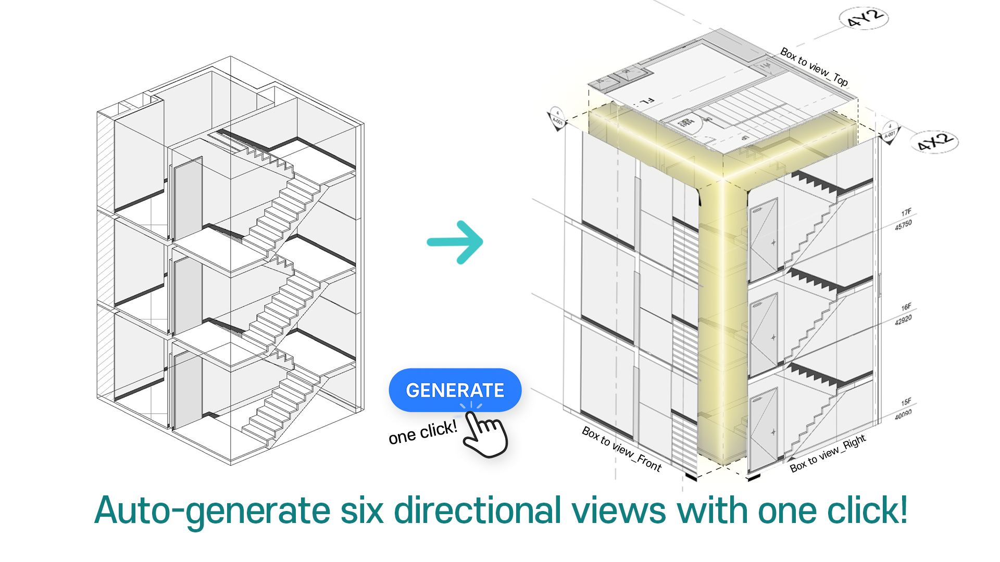

# 25-07-14

## ✨New Add-in ‘Box to View’ is Coming - July 16 ✨

We’re thrilled to let you know that our brand-new **Box to View Add-in** will be launching soon!

***

### 📌 **What is Box to View?**

**Box to View** Add-in is a Revit extension that automatically generates six orthogonal views **(Front, Back, Left, Right, Top, and Bottom)** from any **SectionBox or ScopeBox** you define.

<figure><figcaption></figcaption></figure>

<figure><figcaption></figcaption></figure>

#### ✔️ **6-Direction View Generation** –  Front / Back / Left / Right / Top / Bottom With _just one click_, you instantly generate views for every direction you need. Instead of spending 20–30 minutes setting them up manually, you’ll have them all ready in _under 10 seconds_.

#### ✔️ **View Type & Template Filtering** – For each face, select a View Type (Floor Plan, Section, Elevation, Detail) and then pick its View Template.

* **Top** → Floor Plan / Structural Plan / Section
* **Bottom** → Ceiling Plan / Section
* **Front/Back/Left/Right** → Section / Elevation / Detail View

### 💡 **Why get ready to use this?**

#### “No more wasting time on view setup.”&#xD; “No more errors from project-to-project view settings.”&#xD; “Focus on design, not repetitive tasks.”

***

### 🗓 **Box to View Release Schedule**

**Release Time:**
\
▸Wednesday, July 16, 2025 at 4:00 AM (UTC)
\
▸Wednesday, July 16, 2025 at 1:00 PM (KST)

**Installation:**
\
Box to View will be available in the BIMIL Add-in Manager.
\
Make sure you’ve updated to BIMIL version 1.1.7.0 or higher before installing

***

### 🎯**Coming Next**

Right after the launch of Box to View, we’re rolling out **Excel Sync** next Wednesday.

<figure><figcaption></figcaption></figure>

<table><thead><tr><th width="182.757568359375">Feature</th><th valign="middle">Description</th></tr></thead><tbody><tr><td>✔️ Export in seconds</td><td valign="middle">Pull every parameter from your current Revit model straight into Excel.</td></tr><tr><td>✔️ Edit &#x26; sync back</td><td valign="middle">Modify values in the sheet, press <em>Sync</em>, and watch your model update instantly.</td></tr><tr><td>✔️ Perfect for teams</td><td valign="middle">Ideal for bulk edits, fast QA/QC, and sharing data with colleagues who don’t use Revit.</td></tr></tbody></table>

#### 👉 **Excel Sync is planned to launch next Wednesday!**  Get ready to try it out soon.

***

### 💡 Your idea = the next star add-in

Have a pain point you’d love us to solve? Reply to this email or write to [**help@bimpeers.com**](mailto:help@bimpeers.com?subject=undefined\&body=undefined).\
If we build your idea, you’ll be the first to test it—and we’ll give you a shout-out in the release notes!

Best regards,

The **BIMIL** Team
