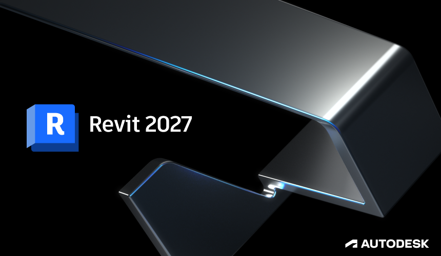

# 26-04-24

We’re excited to announce that Revit 2027 support is officially on its way! We are putting the finishing touches on the updates to ensure everything is ready for your workflow.\
This release is scheduled for **April 29, 2026, at 04:00 UTC (13:00 KST)**.

***

### Revit 2027 Support & Version Policy

<figure><figcaption></figcaption></figure>

All BIMIL add-ins will officially support **Revit 2027** starting next week. As we move forward, we are also updating our version support policy to maintain the best performance:

* **New Minimum Version:** Starting with this release, Revit 2023 will be the new minimum for all upcoming add-ins. New tools will no longer include Revit 2022-compatible versions.
* **Existing Revit 2022 Support:** For add-ins that already support Revit 2022, those versions will remain available for download. However, please note that they will no longer receive any further updates.

***

### Required Add-in Updates

This update includes a core refresh for the BIMIL add-ins to improve stability.\
**Please note that some add-ins will require this update in order to run.**\
We ask for your understanding as this is a necessary step to ensure compatibility across the platform.

***

### New: Instant Keyboard Shortcuts

<figure><figcaption></figcaption></figure>

We’ve added a new **Keyboard Shortcuts** button in the Settings menu and at the top of every add-in window. Clicking this button will take you directly to the Revit Keyboard Shortcuts configuration page, making it easier than ever to customize your workspace.

***

### How to Get the Update

On Wednesday, April 29:

1. Close **Revit** (important for a smooth update).
2. Launch **BIMIL**. It should update automatically to the new version.
3. Click the **Update** button next to the add-ins listed above.
