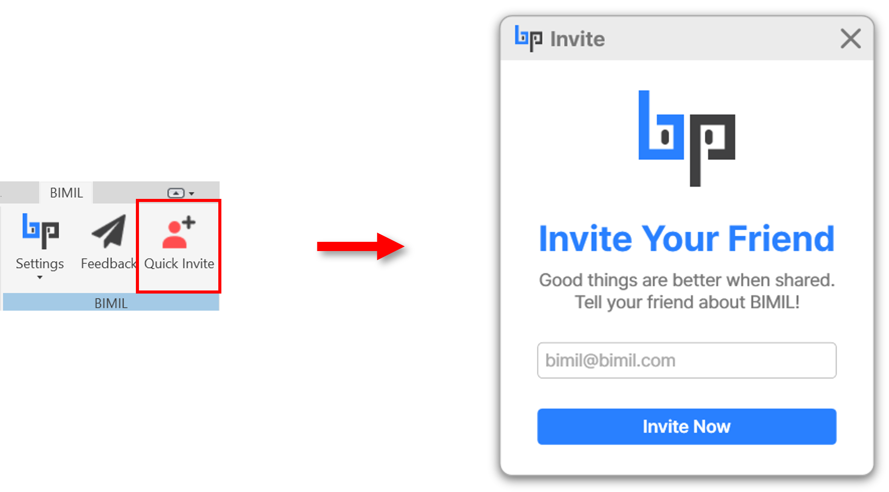

# 👬 Invite Your Friend

## From BIMIL Web (Profile Page)

**How to Invite:**

1. Go to **Account →** [**Invite your friend (Link)**](https://bimil.bimpeers.com/invite).
2. Enter the email address of the person you’d like to invite.
3. Click **Invite Now**.
4. An email will be sent to them with information about BIMIL and how to get started.

**Notes:**

* Make sure to enter a valid email address (e.g., name@company.com).
* Invitations are sent instantly, but delivery time may depend on the recipient’s email provider.

<figure><figcaption></figcaption></figure>

## Directly in Revit (Quick Invite)

**How to Invite:**

1. In the **BIMIL ribbon tab inside Revit**, click **Quick Invite**
2. A pop-up window will appear without leaving Revit
3. Enter your colleague’s email address
4. Click \[**Invite Now]** to send the invitation instantly

<figure><figcaption></figcaption></figure>
