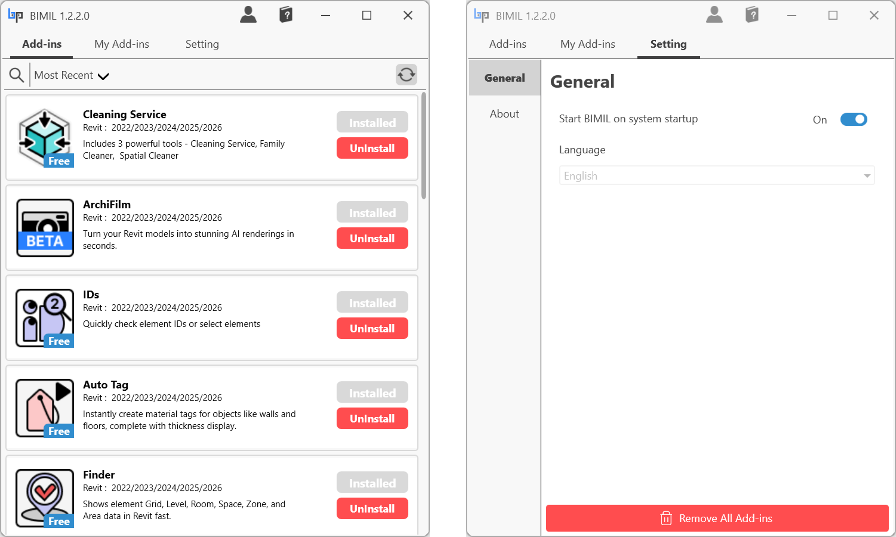

# User Interface

## Main Interface

1. Tabs in BIMIL Manager
   * **Add-ins**: Browse and install all available Add-ins.
   * **My Add-ins**: View only the Add-ins you’ve installed.
   * **Setting**: Manage app options (startup, language, remove all).
2. [Detail view](user-interface.md#detail-view)
3. [General ](user-interface.md#general)
4. [About ](user-interface.md#about)

<figure><figcaption></figcaption></figure>

### Detail view

1. Resize Window\
   \
   To resize the BIMIL application window, hover your mouse over any edge or corner of the window. When the cursor changes to a double-sided arrow, click and drag to adjust the window's size to your preference.

<figure><figcaption></figcaption></figure>

2. Add-in Description\
   \
   To view more details about an add-in, click anywhere on the desired add-in panel. A detailed information window will pop up, showing the add-in's features, version, and compatibility.

<figure><figcaption></figcaption></figure>

### General

1. You can select the **Start BIMIL on system startup** option. When enabled, BIMIL will automatically launch when your system starts.
2. Currently, only English is supported, but more languages will be available in future updates.
3. The **Remove All Add-ins** button will be explained in [the next section](uninstall.md).

<figure><figcaption></figcaption></figure>

### About

1. **Version History**: You can check the version history of BIMIL, including the current version you are using.
2. **Contact for Issues**: If you have any questions or issues, please email [help@bimpeers.com](mailto:help@bimpeers.com) for assistance.
3. **More Information**: For detailed information, visit [https://bimil.bimpeers.com](https://bimil.bimpeers.com).

<figure><figcaption></figcaption></figure>

