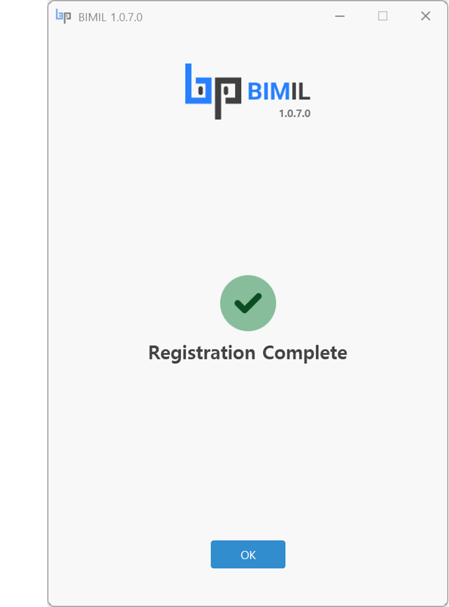

# 회원가입

회원가입을 완료하셨다면,   [다음단계](undefined-2.md)로넘어가세요.


인터넷 연결 상태를 확인하세요.


1. **아이디 (이메일 주소)** : \
   \- 유효한 이메일 주소를 입력하세요. 입력한 이메일로 인증 코드가 전송되므로, 정확한 이메일을 입력해 주세요.
2. **비밀번호** : \
   \- 사용할 비밀번호를 입력하세요. 아래 입력란에 동일한 비밀번호를 다시 입력하여 확인하세요.
3. **이름(First Name) / 성 (Last Name)** :\
   \- 이름 / 성을 입력하세요.
4. **회사 (선택사항)** : \
   \- 회사 이름을 입력하세요. 회사에 소속되어 있지 않다면, 비워두셔도 됩니다.&#x20;
5. **직책 (선택사항)** :\
   \- 직책을 입력하세요.
6. **동의항목** : \
   \- **이용약관** **(Terms and Service)** :  이용약관에 동의하세요.\
   \- **개인정보 처리방침 (Privacy Policy)** :  개인정보 처리방침에 동의하세.\
   \- **마케팅이메일 (Marketing Emails)(선택사항)** : 마케팅 이메일 및 제안 수신에 동의하세요. 선택사항입니다.&#x20;
7. **제출 (Submit)** : \
   \- 모든 필수 항목을 입력하고 약관에 동의한 후, **제출 (Submit)** 버튼을 클릭하여 다음 단계로 진행하세요.

<figure><figcaption></figcaption></figure>

8. **인증 코드( Verification Code)**\
   \- 이메일로 받은 **인증 코드를 입력하세요**.
9. **제출 (Submit)** : \
   \- 인증 코드를 입력한 후, **제출 (Submit)** 버튼을 클릭하여 인증 절차를 완료하세요.
10. **이메일 재전송 (Resend Email)** : \
    \- 이메일을 받지 못한 경우, **이메일 재전송 (Resend Email)** 링크를 클릭하여 인증 코드를 다시 받을 수 있습니다.

<figure><figcaption></figcaption></figure>

11. "등록완료(Registration Complete)" 메시지가 표시되면 회원가입을 완료했습니다.

<figure><figcaption></figcaption></figure>
